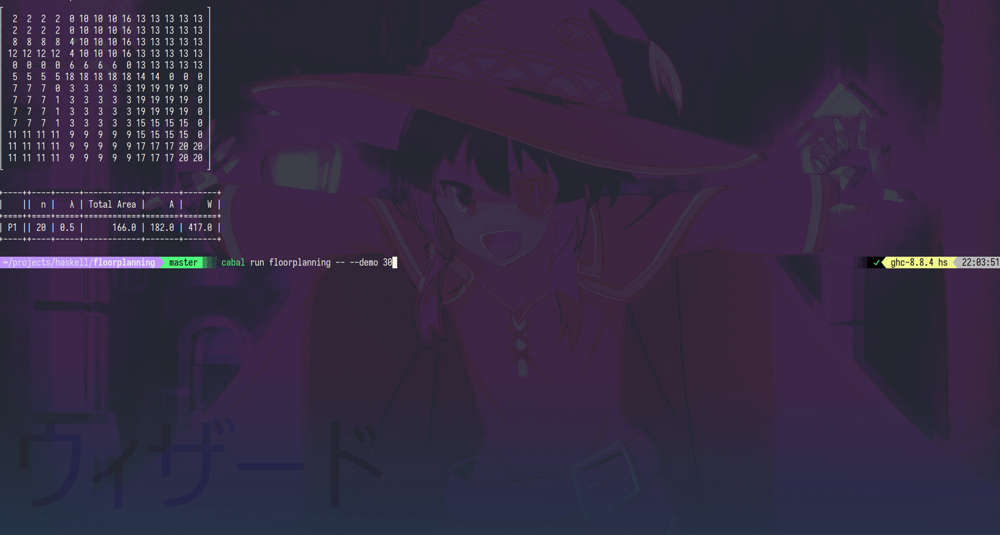

# Floorplanning

Implementation of [_"Floorplan Design of VLSI Circuits"_](https://eecs.wsu.edu/~daehyun/teaching/2014_EE582/papers/fl-polish.pdf).

This code is part of the final project from [Algorithms for AVLSI](https://www.fib.upc.edu/en/studies/masters/master-innovation-and-research-informatics/curriculum/syllabus/AVLSI-MIRI) subject (master's degree in computer science from UPC).



## Try it

You can either try the demo:

```bash
# Replace `n` by the number of modules used for the demo.
# n ~ 50 is recommended.
cabal run floorplanning -- --demo n
```

or one of the examples files from `examples/`:

```bash
$ cabal run floorplanning -- -f "examples/example_20_modules"
============ Report ============
┌                               ┐
│  2  0  0 20 20 20 20 17 17  0 │
│  9  9  9 20 20 20 20 17 17  0 │
│  4  4  0  1  1  1  1 18 18 18 │
│  4  4  0  1  1  1  1 18 18 18 │
│  3  3  6 19 19 19 19 18 18 18 │
│ 11 11  6 12 12 15  0 10 16 16 │
│ 11 11  6 12 12 15  0 14 16 16 │
│ 11 11  6 12 12 15 13 14 16 16 │
│  5  5  5  7  7 15 13 14 16 16 │
│  8  8  8  7  7 15 13 14 16 16 │
└                               ┘

+----++----+-----+------------+-------+-------+
|    ||  n |   λ | Total Area |     A |     W |
+====++====+=====+============+=======+=======+
| P1 || 20 | 0.0 |       92.0 | 100.0 | 157.5 |
+----++----+-----+------------+-------+-------+
```

## Future Work

The second part, L-Shapes modules, is not implemented.
